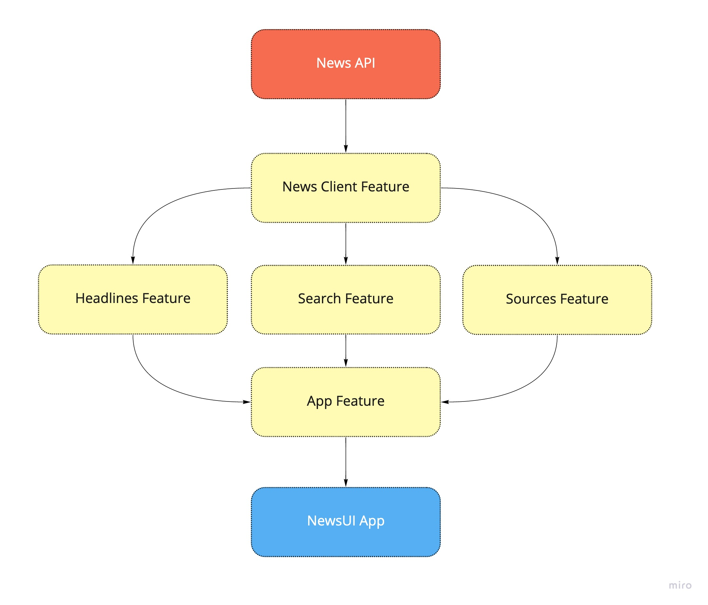

# NewsUI

Simple news iOS app with SwiftUI 🗞️ which uses NewsAPI to fetch top news headlines

The codebase uses following modern keys:

- SwiftUI
- Async/Await
- Swift Package Manager

## Features

- Get Headlines 
- Search News

## Requirements

- Xcode13+
- iOS 15+

## Getting started

- `git clone https://github.com/mtfum/NewsUI`
- cd NewsUI
- insert `YOUR_NEWS_API_KEY` in `NewsClient.swift`, you can get from https://newsapi.org/
- Build SwiftUIApp
- Enjoy! 🎉

## Libraries

- [NewsAPI](https://github.com/mtfum/NewsAPI)
- [SwiftCollections](https://github.com/apple/swift-collections) 

## Architecture

